# quarkus-vs-springboot-reactive-rest-api
Comparison between `Quarkus and Spring Boot` using a simple Reactive RestFul Api.

## Contents
 1. [Requirements](#requirements)
 2. [Tech Stack](#tech-stack)
 3. [Build and Run](#build-and-run)
 4. [Swagger UI](#swagger-ui)
 5. [Quarkus vs Spring Boot Comparision](#quarkus-vs-spring-boot-comparision)
    1. [RestFul API Support](#restful-api-support)
    2. [Reactive Programming Support](#reactive-programming-support)
    3. [MongoDb Reactive Support](#mongodb-reactive-support)
    4. [Swagger Support](#swagger-support)
    5. [Testing](#testing)
    6. [Metrics - Prometheus](#metricsprometheus)
    7. [Docker Build](#docker-build)
    8. [Performance Test](#performance-test)
    9. [Final Results](#final-results)
 6. [Docker Compose](#docker-compose)
 7. [Jmeter](#jmeter)
 8. [Kubernetes/Istio](#kubernetesistio)
 9. [Naive Stress Test](#naive-stress-testing-curl)
 10. [References](#references)

## Requirements

To compile and run this project you will need:

- JDK 8+
- Docker
- Mongodb
- Maven 3.6.3
- Keystore(or use `auth profile` to generate one automatic)

## Tech Stack

- Reactive RestFul API
- MongoDB
- Security(JWT)
- Swagger

## Build and Run

On the root folder compile the source code for both projects.

```
mvn clean compile
```

 - #### Run 
If you are not using `auth profile` you will need to place a public key in `/tmp/publicKey.pem` or setting path `PUBLIC_KEY_PATH`.
 
 - ### Using auth profile

If you are using `auth profile` it will generate a keystore(if not specified in `PRIVATE_KEY_PATH and PUBLIC_KEY_PATH`) and expose endpoint `/api/auth`.

```
QUARKUS_PROFILE=auth mvn compile quarkus:dev

or

mvn spring-boot:run -Dspring-boot.run.arguments="--spring.profiles.active=auth"
```

 - #### Quarkus
Quarkus has a nice `hot deployment feature` that you can easily develop `on the fly` without restarting the service to recompile the classes, that's kind of unusual for Java but very common feature for interpreted languages like `PHP/Python`.

```
cd quarkus
mvn compile quarkus:dev
```
PS: To change default port(`8081`) set `QUARKUS_HTTP_PORT`.

 - ### Spring Boot

Spring Boot has also `hot deployment feature` but need some interaction from the IDE, more details look at [Hot Swapping](https://docs.spring.io/spring-boot/docs/2.0.x/reference/html/howto-hotswapping.html).

```
cd spring-boot
mvn spring-boot:run
```
PS: To change default port(`8080`) set `mvn spring-boot:run -Dspring-boot.run.arguments="--server.port={PORT}"`.

## Swagger UI

To access [Swagger UI](http://localhost:8080/swagger-ui) and generate a valid JWT use `/api/auth` when `auth profile` is on.

Use following roles:
- `ROLE_ADMIN` - Access for all endpoints
- `ROLE_COMPANY_READ` - Read Access to `GET - /api/companies` and `GET - /api/companies/{id}`.
- `ROLE_COMPANY_CREATE` - Create Access to `POST - /api/companies`
- `ROLE_COMPANY_SAVE` - Update Access to `PUT - /api/companies`
- `ROLE_COMPANY_DELETE` - Delete Access to `DELETE - /api/companies`

PS: To generate a JWT first need to `Logout` on Authorize Button.

### Quarkus vs Spring Boot Comparision

 - #### RestFul API Support
- Quarkus

Quarkus has support for `JAX-RS` with [RESTEasy framework](https://resteasy.github.io/) also `Spring Web Annotations`.
<details><summary>Click here to expand...</summary>
<p>

```java
import javax.ws.rs.Consumes;
import javax.ws.rs.GET;
import javax.ws.rs.Path;
import javax.ws.rs.Produces;
import javax.ws.rs.core.MediaType;
import javax.ws.rs.core.Response;

@Path("/api/example")
@Produces(MediaType.APPLICATION_JSON)
@Consumes(MediaType.APPLICATION_JSON)
public class ExampleResource { 
    @GET
    public Response get() {return Response.ok().entity(something).build(); }     
}     
```

</p>
</details>

- Spring Boot

Spring also supports `JAX-RS` but more commonly used is with `Spring Web Annotations`.
<details><summary>Click here to expand...</summary>
<p>

```java
import org.springframework.http.ResponseEntity;
import org.springframework.web.bind.annotation.GetMapping;
import org.springframework.web.bind.annotation.RequestBody;
import org.springframework.web.bind.annotation.RequestMapping;
import org.springframework.web.bind.annotation.RestController;

@RestController
@RequestMapping("/api/example")
public class ExampleController {
    @GetMapping(produces = MediaType.APPLICATION_JSON_VALUE)
    public ResponseEntity<Object> get() {
        return ResponseEntity.ok(something);
    }
}
```

</p>
</details>
     
 - #### Reactive Programming Support
- Quarkus

Quarkus is reactive by default using [Vert.x](https://vertx.io/) under the hood, the reactive rest support is using [Mutiny](https://github.com/smallrye/smallrye-mutiny) also has support for others libraries like `RxJava and Reactor`.
<details><summary>Click here to expand...</summary>
<p>

```java
public class CompanyResource {
    public Multi<Company> getAllActiveCompanies() {
        return Company.streamAll();
    }     

    public Uni<Response> getById(@PathParam("id") String id) {
         return Company.findById(new ObjectId(id))
             .onItem().ifNull().failWith(NotFoundException::new)
             .map(c -> Response.ok(c).build());         
    }
}
```

</p>
</details>

Full example look at [CompanyResource](quarkus/src/main/java/com/github/quarkus/CompanyResource.java).

- Spring Boot

Spring uses [Reactor](https://projectreactor.io/) for reactive programming but also other libraries like `RxJava`.
<details><summary>Click here to expand...</summary>
<p>

```java
public class CompanyController {
    public Flux<Company> getAllActiveCompanies() {
        return companyRepository.findAll();
    }

    public Mono<Company> getById(@PathParam("id") String id) {
        return companyRepository.findById(id)
            .flatMap(Mono::just)
            .switchIfEmpty(Mono.error(new ResponseStatusException(HttpStatus.NOT_FOUND)));
    }
}
```

</p>
</details>

Full example look at [CompanyController](spring-boot/src/main/java/com/github/springboot/controller/CompanyController.java).     
    
 - #### Mongodb Reactive Support
- Quarkus

Quarkus uses [Panache](https://quarkus.io/guides/mongodb-panache) and provides `Active Record Pattern style and repository`, it's a nice library but has a `preview` and is not backward compatibility.
<details><summary>Click here to expand...</summary>
<p>

```java
@MongoEntity(collection = "quarkus_companies")
public class Company extends ReactivePanacheMongoEntity implements Serializable {
    @NotBlank
    public String name;
    public boolean activated;
    
    public static Multi<Company> findActiveCompanies(Integer pageSize) {
        return find("activated", true)
              .page(Page.ofSize(pageSize))
              .stream();
    }
}
```

</p>
</details>

- Spring Boot

Spring uses [Spring Data](https://docs.spring.io/spring-data/mongodb/docs/current/reference/html/#mongo.reactive.repositories) and `repository style` but also support other libraries like `RxJava`.
<details><summary>Click here to expand...</summary>
<p>

```java
@Builder
@Data
@NoArgsConstructor
@AllArgsConstructor
@Document(collection = "springboot_companies")
public class Company implements Serializable {
    @Id
    private String id;
    private String name;
    private Boolean activated;
}

@Repository
public interface CompanyRepository extends ReactiveMongoRepository<Company, String> {
    @Query("{'activated': true}")
    Flux<Company> findActiveCompanies(final Pageable page);
}
```

</p>
</details>

 - #### Swagger Support
- Quarkus

Quarkus has a good support for `OpenApi and Swagger UI` just needed library `quarkus-smallrye-openapi` and a few annotations.

<details><summary>Click here to expand...</summary>
<p>

```java
@OpenAPIDefinition(tags = {@Tag(name="company", description="Operations related to companies")})
@SecuritySchemes(@SecurityScheme(securitySchemeName = "api_key",
		type = SecuritySchemeType.APIKEY,
		apiKeyName = "Authorization",
		in = SecuritySchemeIn.HEADER)
)
public class ResourceApplication extends Application {
}

```

</p>
</details>

Full example look at [ResourceApplication](quarkus/src/main/java/com/github/quarkus/ResourceApplication.java).     

- Spring Boot

Spring Boot has some issues using `WebFlux with Swagger UI` and no default support for OpenApi.
To achieve Swagger UI was necessary to use `SpringFox SNAPSHOT version`.

 - ### Testing
 
- Quarkus

Quarkus basic has `@QuarkusTest` annotation and recommends to use `rest-assured` but had some issues to test reactive rest apis with security(jwt).
Had some issues also to test `Embedded MongoDb` needed to add a class to start mongodb manually.

<details><summary>Click here to expand...</summary>
<p>

```java
public class MongoTestResource implements QuarkusTestResourceLifecycleManager {
	private static MongodExecutable MONGO;

	private static final Logger LOGGER = Logger.getLogger(MongoTestResource.class);

	@Override
	public Map<String, String> start() {
		//StartMongoDb
	}
}

@QuarkusTest
@QuarkusTestResource(MongoTestResource.class)
public class CompanyResourceTest {
}
```

</p>
</details>

Full example look at [MongoTestResource](quarkus/src/test/java/com/github/quarkus/MongoTestResource.java) and [CompanyResourceTest](quarkus/src/test/java/com/github/quarkus/CompanyResourceTest.java).

- Spring Boot

Spring Boot has a good testing api using `@SpringBoot, @DataMongoTest and @WebFluxTest`, more details look at [spring tests](spring-boot/src/test/java/com/github/springboot).  

 - ### Metrics(Prometheus)
- Quarkus

Quarkus uses `Microprofile annotations` like `@Timed, @Metered, @Counted` but need to add it manually for each endpoint, more details look at [CompanyResource](quarkus/src/main/java/com/github/quarkus/CompanyResource.java).

- Spring Boot

Spring Boot uses `micrometer` and has easy integration with prometheus just need library `micrometer-registry-prometheus`.

 - ### Docker Build
- Quarkus
     
It has by default support to build a docker image and a native image also.
To build a docker image:
```
cd quarkus
mvn clean package -Dquarkus.container-image.build=true
docker build -f src/main/docker/Dockerfile.jvm -t quarkus .
```

To build native image
```
mvn package -Pnative -Dquarkus.native.container-build=true
docker build -f src/main/docker/Dockerfile.native -t quarkus .
```
PS: The native image didn't work for me using laptop `i7 16GB dell inpiron`.

- Spring Boot

Spring Boot doesn't have a built-in docker image but can easily use `jib or fabric8`.
To build a docker image using [fabric8 plugin](https://dmp.fabric8.io/):
```
cd spring-boot
mvn clean install docker:build
```
    
 - ### Performance Test
I've used 2 replicas for each service and deployed pods to GKE.  
 
 - #### Boot Time
- Quarkus

Quarkus is really fast to startup as you can see in attached images below, it took less than 5 seconds.
Replica 1

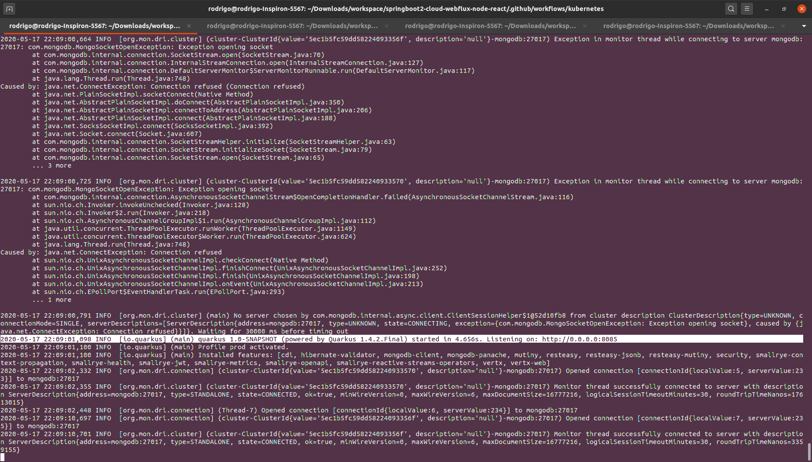

Replica 2

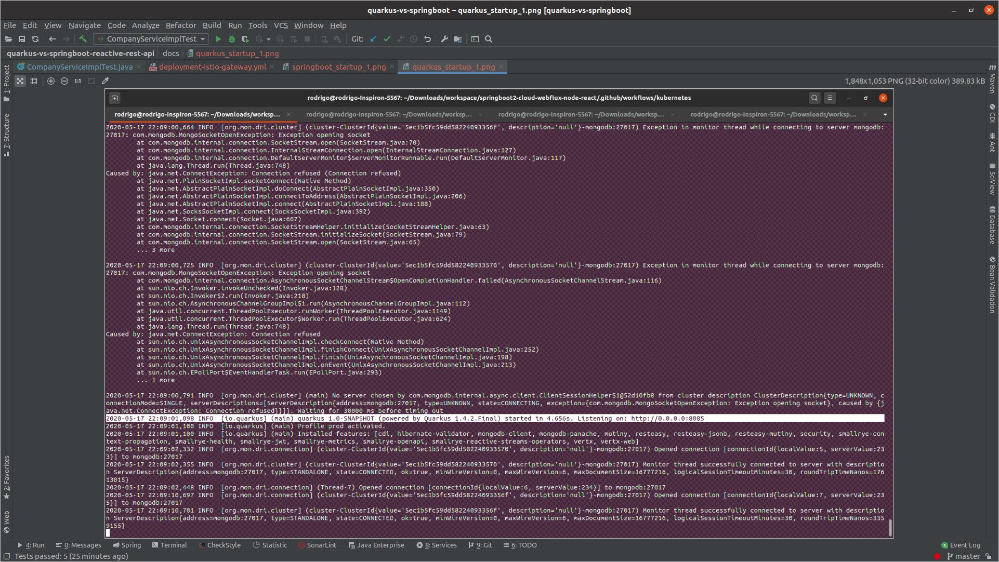

- Spring Boot

Spring Boot is not so fast as Quarkus but also not too slow it took average 23 seconds to startup.
Replica 1

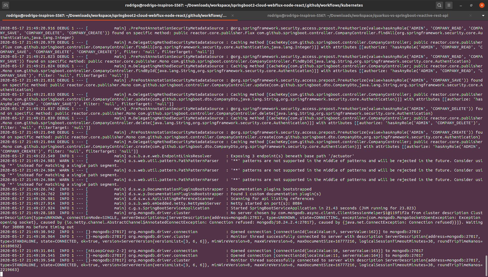

Replica 2

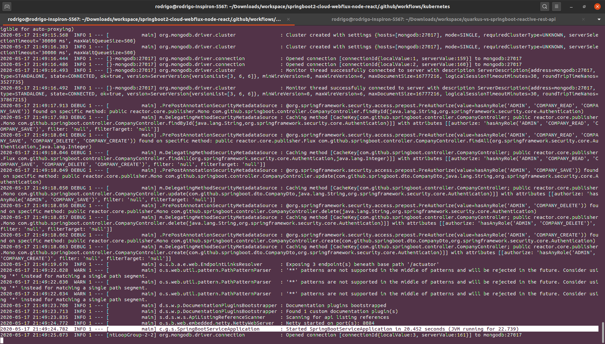

 - #### Stress 100 tps per sec
- Quarkus

 - Quarkus was slower than Spring Boot to handle the requests but I believe if I change the connection pool would perform better.
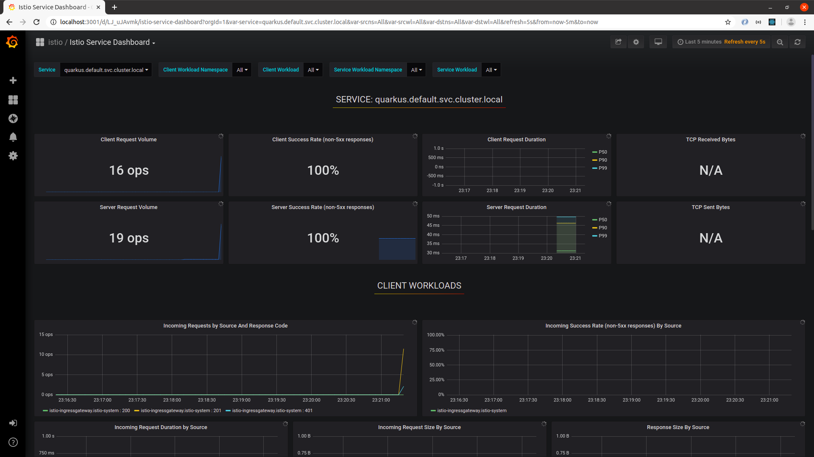
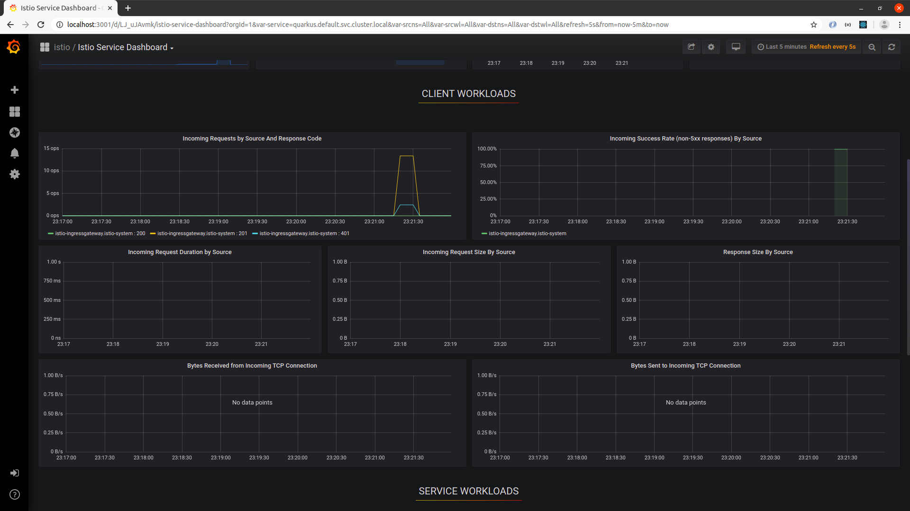
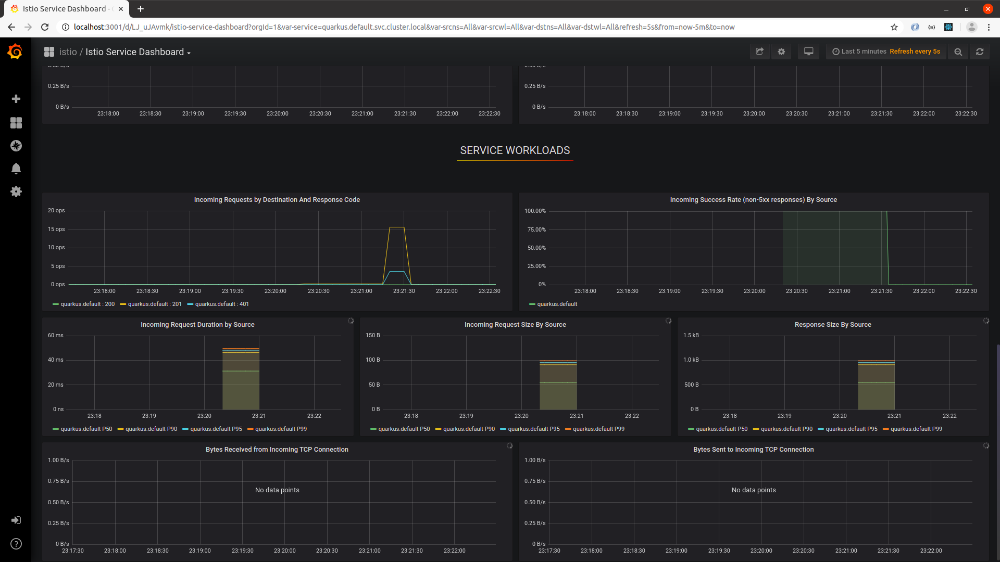  

- Spring Boot

 - Spring Boot handle the requests faster
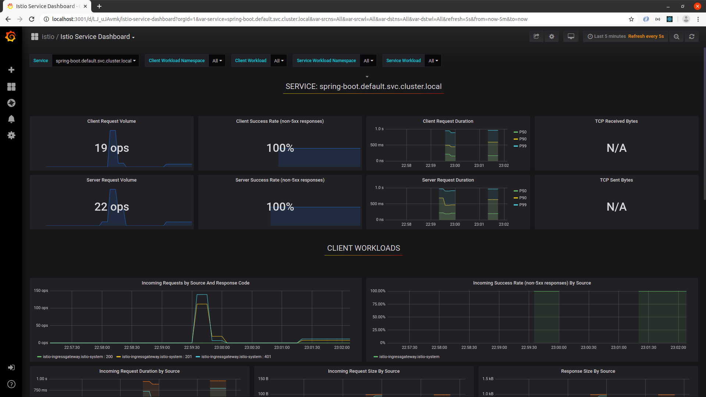
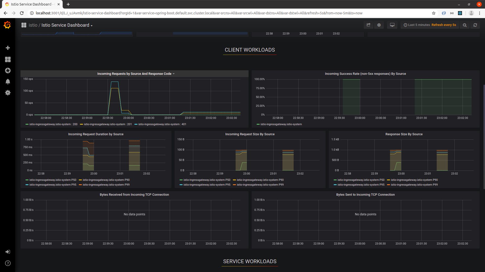
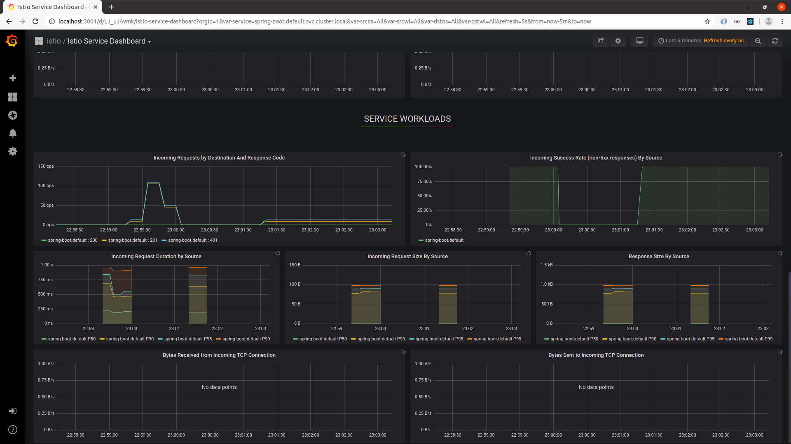  

 - #### Stress 500 tps per sec(10 times)
I've also tested with 3 replicas and had similar results.
- Quarkus

3 Replicas

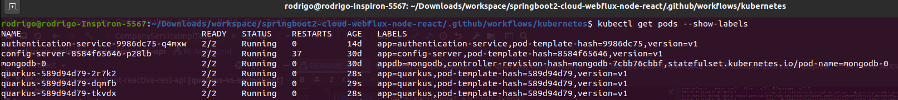

Boot Time

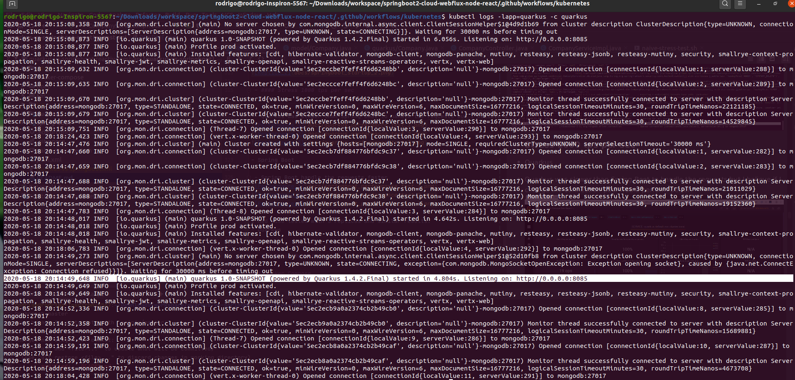

Result

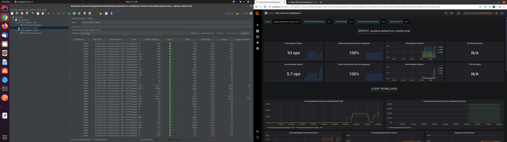


- Spring Boot

3 Replicas

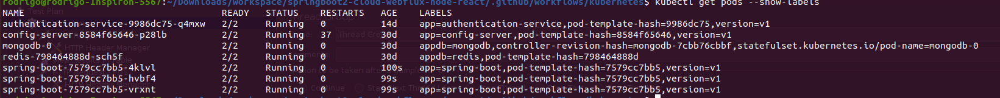

Result

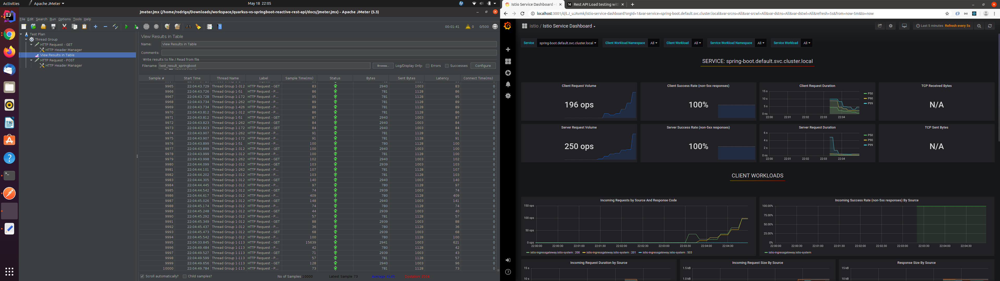
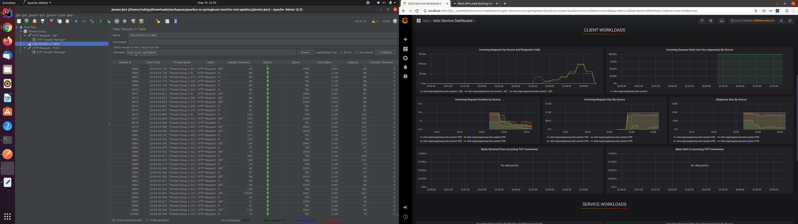
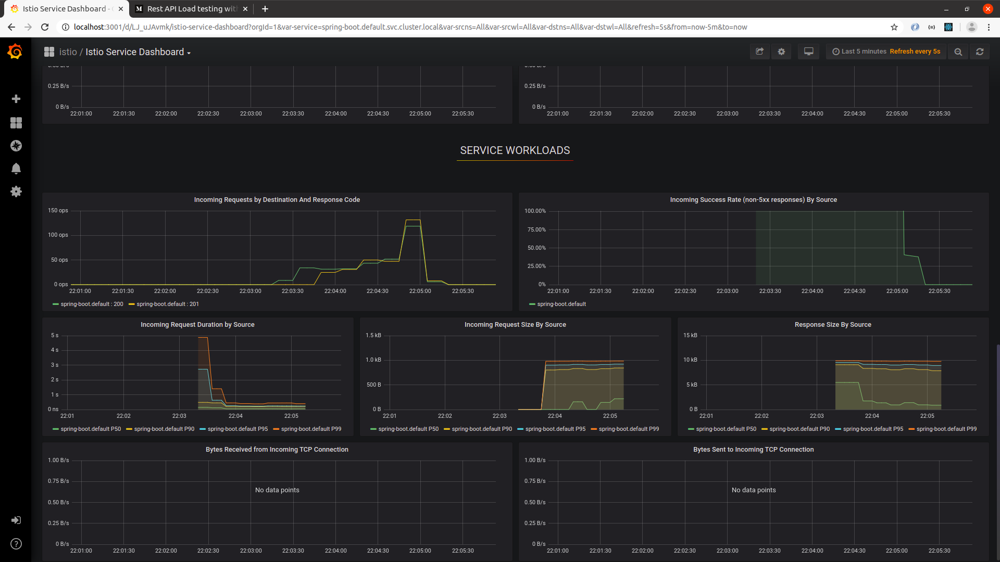

 - ### Final Results
| Topics  | Winner - IMHO :) |
| ------------- | ------------- |
| RestFul API Support  | draw  |
| Reactive Programming Support  |   |
| MongoDb Reactive Support  |   |
| Swagger Support  |   |
| Testing  |   |
| Metrics - Prometheus  |   |
| Docker Build  |   |
| Performance Test  |   |


### Docker Compose

Once [the docker images are build](#docker-build) you can use `docker-compose` to run both services with `mongodb, prometheus and grafana`.

### Jmeter

Check [jmeter folder](jmeter) to run performance tests and see the results for both services.

### Kubernetes/Istio

Check [k8s folder](k8s) for kubernetes and istio configuration.

```shell script
cd docker-compose
docker-compose up -d
```

### Naive Stress Testing cURL
- Create
```shell script
./naive-stress-test.sh -c 1 -r 1 \
-a localhost:8080/api/companies \
-X POST \
-H "Authorization: bearer XXXX" \
-H "Content-Type: application/json" \
-d '{"name": "test curl", "activated": true}'
```

- Create appending body with microseconds
```shell script
./naive-stress-test.sh -c 1 -r 1 \
-a localhost:8080/api/companies \
-X POST \
-H "Authorization: bearer XXXX" \
-H "Content-Type: application/json" \
-d '{"name": "test curl - #INCREMENT_TIMESTAMP", "activated": true}'
```

- Get
```shell script
./naive-stress-test.sh -c 1 -r 1 \
-a localhost:8080/api/companies \
-X GET \
-H "Authorization: bearer XXXX" \
-H "Content-Type: application/json"
```
### References
- [WebFlux Security](https://docs.spring.io/spring-security/site/docs/current/reference/html5/#jc-webflux)
- [Read Private/Public Key](https://gist.github.com/destan/b708d11bd4f403506d6d5bb5fe6a82c5)
- [Quarkus Rest](https://quarkus.io/guides/rest-json)
- [Quarkus JWT](https://quarkus.io/guides/security-jwt#generating-a-jwt)
- [Quarkus MongoDb Pinache](https://quarkus.io/guides/mongodb-panache)
- [Quarkus Reactive](https://quarkus.io/guides/getting-started-reactive#mutiny)
- [Mutiny Reactive](https://smallrye.io/smallrye-mutiny/)
- [Generate RSA Keys](https://www.novixys.com/blog/how-to-generate-rsa-keys-java/)
- [Quarkus vs Spring Boot](https://dzone.com/articles/microservices-quarkus-vs-spring-boot)
- [MongoDB Convert to Capped Collection](https://stackoverflow.com/questions/7904526/how-to-create-a-capped-collection-with-spring-data-mongodb)
- [Stress Test cURL](https://gist.github.com/cirocosta/de576304f1432fad5b3a)
- [Prometheus and Grafana](https://www.callicoder.com/spring-boot-actuator-metrics-monitoring-dashboard-prometheus-grafana/)
- [JMeter](https://medium.com/@chamikakasun/rest-api-load-testing-with-apache-jmeter-a4d25ea2b7b6)
